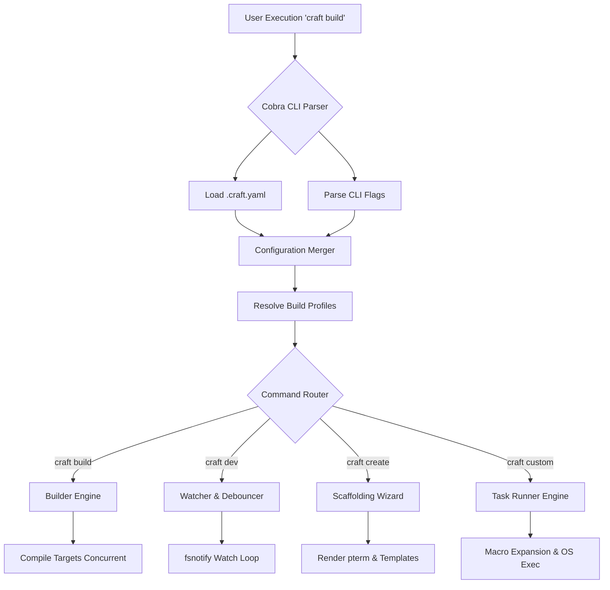

# Craft Architecture Overview

Craft is engineered as a robust, declarative orchestrator specifically tailored for the Go ecosystem. It bridges the gap between primitive `go build` shell scripts and overly complex CI/CD orchestration tools by acting as a unified middleware engine.

This document outlines the internal architecture, core modules, and the execution pipeline of the Craft CLI.

## Core Execution Pipeline

When you invoke a `craft` command, the engine goes through a deterministic lifecycle to ensure your environment, configuration, and source code are perfectly aligned.

## Core Modules

### 1. Configuration & Merger Engine
Craft's behavior is entirely driven by the `AppConfig` struct, which is populated by `.craft.yaml`. The Merger Engine acts as the source of truth, establishing priority:
1. **CLI Flags** (Highest Priority - e.g., `--out dist`)
2. **Build Profiles** (e.g., `craft build -P release`)
3. **Global `craft.yaml` settings** (Lowest Priority)

This ensures CI/CD environments can dynamically override local settings without modifying files.

### 2. The Builder Engine
The Builder is a highly optimized wrapper around the native Go toolchain (`go build`). It does not reinvent compilation; instead, it orchestrates it beautifully.
* **Target Resolution**: Dynamically calculates the OS/Arch build matrix based on configuration.
* **Concurrent Compilation**: When multiple platforms are targeted, the Builder spawns goroutines to compile them simultaneously.
* **LDFLAGS Injection**: Safely injects variables (like version numbers and timestamps) into the binary dynamically using `-X` flags.

### 3. Hot-Reload Watcher
The `dev` command uses a sophisticated, debounced filesystem watcher powered by `fsnotify`.
* **Smart Debouncing**: Prevents multiple rebuilds from triggering when an IDE (like VSCode) saves multiple files in a fraction of a second (defaults to 500ms).
* **Isolated Temporary Builds**: Unlike traditional tools, `craft dev` compiles to a hidden, secure OS temporary directory (`/tmp/craft-dev-...`). This prevents your working directory from being littered with intermediate binaries.
* **Graceful Shutdown**: Intercepts `SIGINT`/`SIGTERM` to gracefully kill the running sub-process before exiting, preventing zombie processes on specific operating systems.

### 4. Task Runner
The Task Runner is Craft's native command orchestration engine.
* Parses the `commands` block in `.craft.yaml`.
* Injects runtime macros (e.g., `{OS}`, `{APP_BIN_PATH}`).
* Routes execution directly through the host operating system's native shell (`cmd.exe` or `sh`), enabling output piping and native operators.

### 5. Scaffolding Wizard
Craft provides immediate value to new projects via the `init` and `create` commands.
* **`init`**: Scans an existing directory, parses `go.mod`, locates the `main.go` entry point, and automatically generates an optimized `.craft.yaml`.
* **`create`**: Uses `pterm` for a beautiful, interactive CLI wizard that templates complete boilerplate projects (Fiber, Gin, or Cobra) from an embedded filesystem.

---

> [!TIP]
> Craft's modular design means you can use it strictly as a build orchestrator, just as a task runner, or as your complete daily driver for Go development.
